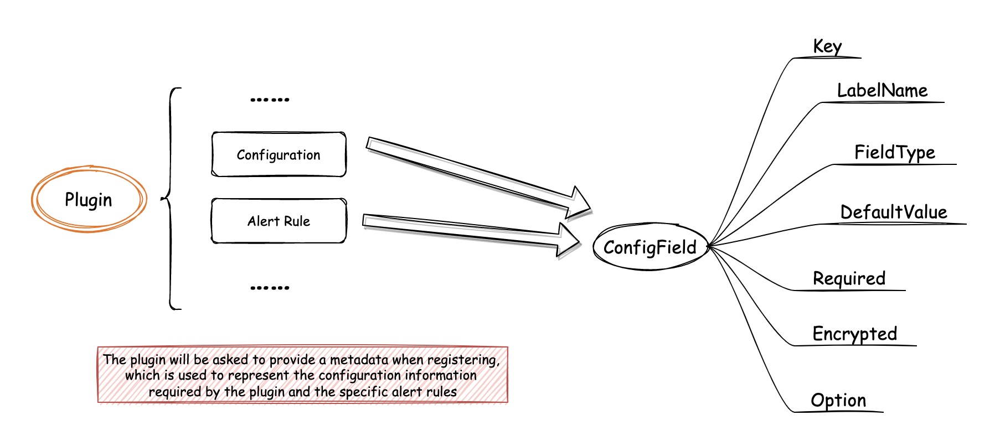

# 插件说明

## 1、插件升级

插件的升级主要在以下两方面：

- **Configuration**

  > 插件所需要的配置信息。

- **Alert Rule**

  > 插件所有的告警规则表单

插件后续迭代可能会移除之前的一些配置，或者添加新的配置，在升级过程需要考虑到配置变更给正在运行到任务造成的影响。

在添加插件的时候会将插件的元数据保存起来，包括：

- 插件的配置表单信息，也就是上图中的 **Configuration**（对应代码中的 `PluginConfigField`）
- 插件所有的告警规则表单信息，也就是上图中的 **Alert Rule**（对应代码中的 `PluginAlertField`）
- 不同系统告警级别下为插件绑定的告警规则表单信息（对应代码中的`PluginAlertRule`）
- 系统告警级别对应的插件系统的告警级别（ScheduleBySelf为true的插件）（对应代码中的`PluginAlarmLevelMapping`）

### :one:：未创建任务或还未填写配置

> 插件已添加，但未创建任务
>
> 创建了任务，但没有填写插件配置和告警规则

这几种情况下插件升级只要 **删除** 以下信息并重新写入：

- PluginConfigField
- PluginAlertField
- PluginAlertRule
- PluginAlarmLevelMapping

### :two:：任务未执行

> 创建了任务，并填写了插件配置或告警规则，但任务还没有执行或已暂停了

在任务没有运行的情况下，即使已经填写了插件配置，也可以将插件所有的元数据删除再重新写入，包括：

- PluginConfigField
- PluginAlertField
- PluginAlertRule
- PluginAlarmLevelMapping

只需要注意在用户启动任务的时候需要检查配置的填写情况，配置缺失则提醒用户重新填写即可。

### :three:：任务在执行当中

> 创建了任务，填写了配置信息，并且有任务在执行当中

这里有两种方案：

第一种是先暂停使用了该插件的任务，替换新的元数据，让用户填写新配置之后再启动任务；

第二种是不暂停任务，直接替换新的元数据，在任务执行过程中报错，将执行报错信息发送给系统，让任务自动停止。

对于`ScheduleBySelf`为 **true** 的插件，升级暂时不会对现有任务造成影响；

而对于`ScheduleBySelf`为 **false** 的插件，升级一定会对现有任务造成影响（如果添加了新的必须配置的话）。

因此，我们可以对`ScheduleBySelf`为 **true** 的插件使用第二种方法，对`ScheduleBySelf`为 **false** 的插件使用第一种方法。

## 2、插件禁用

:one:：停止正在运行的任务

:two:：添加任务不能再选取禁用了的插件

## 3、插件删除

:one:：停止正在运行的任务

:two:：将数据库中插件的信息删除