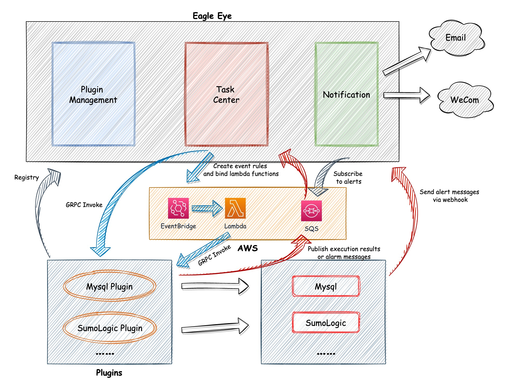
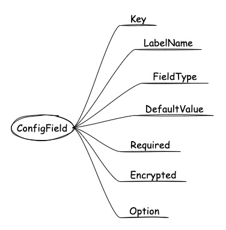

# Eagle Eye
[](https://gitlab.smsassist.com/nerko/eagle-eye/eagle-eye-backend/-/commits/develop)
[](https://gitlab.smsassist.com/nerko/eagle-eye/eagle-eye-backend/-/commits/develop)




## 1、PluginService

**插件** 作为 **gRPC Server端** 需要实现以下方法：

```protobuf
service PluginService{
  rpc FetchMetadata(google.protobuf.Empty) returns (RegisterResponse);
  rpc CreateOrExecute(CreateTaskRequest) returns (CreateTaskResponse);
  rpc Remove(DeleteTaskRequest) returns (GeneralResponse);
  rpc Edit(UpdateTaskRequest) returns (GeneralResponse);
}
```


### 1.1、FetchMetadata

首先是获取插件元数据的方法

```protobuf
service PluginService{
  rpc FetchMetadata(google.protobuf.Empty) returns (RegisterResponse);
}

message RegisterResponse{
	// 插件名称
  string name = 1;
  // 插件描述信息
  string description = 2;
  // 插件版本号
  int32 version = 3;
  // 配置字段
  repeated ConfigField fields = 4;
  // 选择器数据源
  repeated SelectOption options = 5;
  // 是否可自行按频率执行
  bool scheduleBySelf = 6;
  // 所有的告警规则
  repeated  ConfigField alerts = 7;
}

message ConfigField{
  // 字段的key
  string key = 1;
  string labelName = 2;
  // 类型，见FieldType说明
  FieldType type = 3;
  // 字段默认值
  string defaultValue = 4;
  // 字段是否必须
  bool required = 5;
  // 字段是否加密
  bool encrypted = 6;
  // 显示顺序
  int32 order = 7;
  // 引用到的数据源
  string option = 8;
}

message SelectOption {
  string key = 1;
  repeated SelectOptionItem items = 2;
}

message SelectOptionItem {
  string label = 1;
  int32 value = 2;
}

enum FieldType{
  FIELD_UNKNOWN = 0;
  INPUT = 1;
  PASSWORD = 2;
  SQL_EDITOR = 3;
  LOG_EDITOR = 4;
  RULE_EDITOR = 5;
  RULE_SINGLE_EDITOR = 6;
  EMAIL_INPUT = 7;
}
```

#### 1.1.1、自定义字段类型介绍

##### SelectOption

描述选择器的数据源，指定了用户的可选内容。


##### ConfigField

描述表单的元数据，在插件配置表单和告警规则表单都会用到。

如果FieldType是选择器类型的话，option字段指明选择器使用的数据源，用户只能在指定数据中进行选择。




#### 1.1.2、字段说明

##### fields

插件的配置表单，要求用户提供数据，用于任务执行，例如 `数据库账号` 和 `密码`


##### options

插件提供的选择器数据源，插件可提供多个数据集，例如 `用户列表` 和 `地区列表`


##### scheduleBySelf

表示插件是否可自行按频率执行任务。

- true：插件执行任务时需按请求中的频率来执行任务
- false：插件不需要管任务的执行频率，会由其他组件统一调度


##### alerts

插件所有的告警规则表单


#### 1.1.3、示例

```json
{
  "name": "Test Plugin",
  "description": "Test plugins for the Eagle-Eye platform",
  "version": 1,
  "scheduleBySelf": false,
  "fields": [
    {
      "key": "name",
      "labelName": "UserName",
      "type": 1,
      "defaultValue": "",
      "required": true,
      "encrypted": false,
      "order": 1,
      "option": ""
    },
    {
      "key": "pwd",
      "labelName": "Password",
      "type": 2,
      "defaultValue": "",
      "required": true,
      "encrypted": true,
      "order": 2,
      "option": ""
    }
  ],
  "alerts": [
    {
      "key": "compareType",
      "labelName": "Compare Type",
      "type": 5,
      "defaultValue": "",
      "required": true,
      "encrypted": false,
      "order": 1,
      "option": "compare"
    },
    {
      "key": "compareValue",
      "labelName": "Compare Value",
      "type": 1,
      "defaultValue": "1",
      "required": true,
      "encrypted": false,
      "order": 2,
      "option": ""
    }
  ],
  "options": [
    {
      "key": "compare",
      "items": [
        {
          "label": "LESS_THAN",
          "value": 1
        },
        {
          "label": "GREATER_THAN",
          "value": 2
        },
        {
          "label": "LESS_THAN_OR_EQUAL",
          "value": 3
        },
        {
          "label": "GREATER_THAN_OR_EQUAL",
          "value": 4
        },
      ]
    },
    {
      "key": "province",
      "items": [
        {
          "label": "湖南",
          "value": 1
        },
        {
          "label": "北京",
          "value": 2
        }
      ]
    }
  ]
}
```


### 1.2、CreateOrExecute

执行任务的方法

```protobuf
service PluginService{
  rpc CreateOrExecute(CreateTaskRequest) returns (CreateTaskResponse);
}

message CreateTaskRequest{
  string id = 1;
  string name = 2;
  string description = 3;
  string config = 4;
  repeated AlertRule rules = 5;
}

message CreateTaskResponse{
  string Id = 1;
  bool triggered =2;
  string alarmMessage=3;
}

message AlertRule {
  string alarmLevel = 1;
  string rule = 2;
  int32 interval = 3;
}
```

#### 1.2.1、字段说明

##### 1⃣️ CreateTaskRequest.id


##### 2⃣️ CreateTaskRequest.config

插件的配置


##### 3⃣️ CreateTaskRequest.rules

插件的告警规则


##### 4⃣️ CreateTaskResponse.id


##### 5⃣️ CreateTaskResponse.triggered

表示任务是否被正常触发


#### 1.2.2、示例


### 1.3、Edit

修改任务的方法，字段含义与create方法一样

```protobuf
service PluginService{
  rpc Edit(UpdateTaskRequest) returns (GeneralResponse);
}

message UpdateTaskRequest{
  string mappingId = 1;
  string name = 2;
  string description = 3;
  string config = 4;
  repeated AlertRule rules = 5;
}

message AlertRule {
  string alarmLevel = 1;
  string rule = 2;
  int32 interval = 3;
}

message GeneralResponse{
  bool success=1;
  string errorMessage =2;
}
```


### 1.4、Remove

删除任务的方法

```protobuf
service PluginService{
  rpc Remove(DeleteTaskRequest) returns (GeneralResponse);
}

message DeleteTaskRequest{
  string mappingId=1;
  string config = 2;
}

message GeneralResponse{
  bool success=1;
  string errorMessage =2;
}
```

#### 1.4.1、字段说明

##### 1⃣️ mappingId

这个id是执行任务时插件返回的id，就是上面的 `CreateTaskResponse.id`


##### 2⃣️ config


## 2、发送告警消息

告警有两种方式，一种是通过指定的 **接口**，另外一种是通过 **Amazon SQS** 发布消息进行告警。

除了执行任务时告警信息无法同步返回的插件，其他插件无需关心告警的方式，只需要实现约定好的接口即可。


### 2.1、告警接口

无法同步返回告警信息的插件，通过该接口将告警结果发送给平台

| 接口地址             | 请求方式 |
| -------------------- | -------- |
| /v1/alert/we b ho ok | POST     |

**Request Body:**

| 字段         | 是否必须 | 说明 |
| ------------ | -------- | ---- |
| uniqueField  | 是       |      |
| uniqueValue  | 是       |      |
| alarmLevel   | 否       |      |
| alarmMessage | 是       |      |


### 2.2、Amazon SQS

**AWS Lambda 函数** 通过 **SQS** 将插件的告警信息发送出去，告警格式与接口保持一致。
